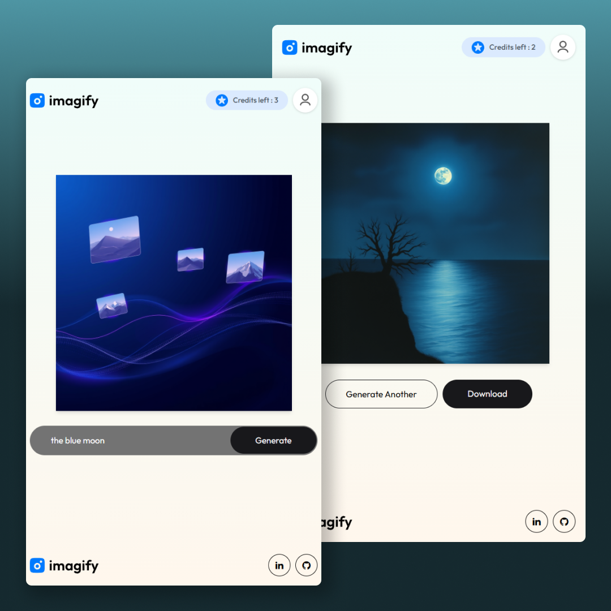

# Imagify - AI Image Generator 🖼️✨

This is a full-stack AI image generator app built with the **MERN stack** (MongoDB, Express.js, React.js, Node.js).  
It allows users to **generate AI images**, **buy credits** (via **Razorpay**), **login/register**, and **download** the images.

## 🚀 Tech Stack

- **Frontend**: React.js, Tailwind CSS, React Router, Axios, React Toastify, Framer Motion
- **Backend**: Node.js, Express.js, MongoDB, Razorpay Integration
- **Authentication**: JWT (JSON Web Tokens)
- **Payments**: Razorpay
- **State Management**: React Context API

## ✨ Features

- 🔐 **User Authentication** (Login / Signup)
- 🧠 **AI Image Generation** from text prompts
- 🛒 **Credits System** (users need credits to generate images)
- 💳 **Secure Payment Gateway** (Razorpay) to purchase credits
- 📦 **Download Generated Images**
- 📱 **Fully Responsive** for mobile, tablet, and desktop
- 🛠️ **Modern UI** with smooth animations

## ⚙️ Environment Variables

Create a `.env` file in both **client** and **server** with the following:

### Client (`client/.env`)

```bash
VITE_BACKEND_URL=http://localhost:3000
VITE_RAZORPAY_KEY_ID=your_razorpay_key_id
```

### Server (`server/.env`)

```bash
PORT=3000
MONGO_URI=your_mongodb_connection_string
JWT_SECRET=your_jwt_secret_key
CLIPDROP_API=your_clipdrop_api_key
RAZORPAY_KEY_ID=your_razorpay_key_id
RAZORPAY_KEY_SECRET=your_razorpay_key_secret
CURRENCY="INR"
```

## 🛠️ Setup Instructions

### 1. Clone the repository

```bash
git clone https://github.com/your-username/Imagify.git
cd imagify
```

### 2. Install server dependencies

```bash
cd server
npm install
```

### 3. Install client dependencies

```bash
cd ../client
npm install
```

### 4. Run the development servers

- Start server:

```bash
cd server
npm start
```

- Start client:

```bash
cd ../client
npm run dev
```

The client will run at http://localhost:5173
The server will run at http://localhost:3000

## ✨ UI Preview

> Here's a quick look at the design and flow of the project:

|                Landing Page                |         Authentication Form          |               Image Generation                |              Buy Credits              |
| :----------------------------------------: | :----------------------------------: | :-------------------------------------------: | :-----------------------------------: |
|  |  |  |  |
